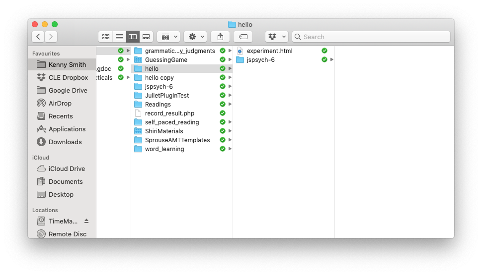

## The plan for the preparatory practical

The plan is for you to learn enough of the basics of jsPsych so we can jump in to building simple experiments immediately when the course starts. Remember, the idea is that you do as much of this as you can on your own (which might be all of it or might be none of it!) and then you can use Slack or the course Zoom sessions to get help with stuff you need help with.

## Our server

Most of the code here will work just running on your computer - each experiment has an html file, you can just open that file in a web browser on your computer (use Chrome). But some of fancier stuff (saving data, playing and recording audio) relies on the code being hosted on a *server*, a computer somewhere else that is designed to deliver code and files to other computers over the network. When we teach our students at Edinburgh we use a teaching server, `jspsychlearning.ppls.ed.ac.uk`, where students can upload code and test out experiments. You don't have access to this server, but our technical support people have set up a temporary equivalent that will be available to you in January. This is called `jspsychks.ppls.ed.ac.uk` - so anywhere you see a reference to `jspsychlearning.ppls.ed.ac.uk` (e.g. in the intro tutorials), just remember that for you this will be `jspsychks.ppls.ed.ac.uk`. I will provide you with your login details once the server is open. In the meantime, you can make progress on the first few practicals by running code locally, i.e. opening the html file in Chrome on your computer.

## Practical tasks

Read the notes and caveats below, then work through sections 00, 01, 02, 03 and 04 of [Online Experiments with jsPsych tutorial](https://softdev.ppls.ed.ac.uk/online_experiments/index.html).

Once you have done these tasks you should be able to access the teaching server, upload code, edit code in something like Atom, and have a (very basic) idea of what a trivial jsPsych "hello world" experiment looks like, and have a bit of an idea of timelines. In the next practical we'll look at an actual experiment written in jsPsych.

Some things to note as you work through the practical.
- jsPsych is quite frequently updated; when I taught this course in October-December 2020 we were using version 6.1.0, they latest release is 6.2.0, I'll try to update these notes to use version 6.2.0 but if you see ocasional references to 6.1.0 that's why. You can get version 6.2.0 [from github](https://github.com/jspsych/jsPsych/releases/tag/v6.2.0), click on the link called `jspsych-6.2.0.zip` at the very bottom to [download the zip file](https://github.com/jspsych/jsPsych/releases/download/v6.2.0/jspsych-6.2.0.zip), uncompress it, and then you can copy that folder to where you need it.
- We will be playing with code on the teaching server, which will be `jspsychks.ppls.ed.ac.uk` (and not `jspsychlearning.ppls.ed.ac.uk`). The server will be accessible in January. Until then, you won't be able to access it, but you can still read through the tutorial, and run the code on your local computer by opening the html file in Chrome.
- In section 02, the tutorial recommends using CyberDuck for uploading files to the server - I agree, it's very nice. Just to emphasise, *you don't need to pay for it*, although it will ask you if you'd like to occasionally. I have bought a license because I use it a lot, if that helps assuage your guilt.
- There are two ways you can use Cyberduck. You can either download files to your local computer, edit them, and re-upload them. This is quite laborious, because every time you make a change you have to re-upload the file. Cyberduck also offers a very nice option to edit the file directly (right-click the file in Cyberduck and select "Edit with..." and then select an editor, below I recommend Atom). This is much more convenient, but sometimes the version you are editing becomes decoupled from the version on the server - so you are editing the file but those changes are not saved to the server. Watch out for this, because it's very confusing - if you are changing the experiment but the version on the server seems not to change, this might be why! See the note below on common problems.
- In section 03 the tutorial runs through some potential editors you can use to view/edit code. I am using Atom on a Mac, it's OK - if you want to use that you might have to download it from [the Atom website](https://atom.io).
- Note that in the jsPsych "hello world" tutorial, the name of the directory they give for the jspsych code might not match the name of the directory for you. In the tutorial it says that you load the various bits of jsPsych code with code like ``, but for me the downloaded jspsych code is actually in a directory called `jspsych-6.1.0` so I had to edit that script call to read ``, just so the browser is looking in the right place. If you try to run the hello world tutorial code and get a blank screen and a bunch of errors in the console telling you that it can't find certain files, this might be the problem.
- Section 04 is a bit more complex. The key things you need to take away from that part of the tutorial are: how to displaying results on-screen at the end of the experiment; the basic info on key codes for keyboard-response trials; the general gist of timeline variables - we won't be doing anything with factorial designs, but we will sometimes use a very simple kind of timeline variable.

## Solutions to common problems

See below for some solutions to recurring problems. Remember, if you need help getting any of this stuff to work, remember that the practical drop-in sessions and the chat on Teams are available.

### I just get a blank screen

A classic problem is that you try to run your code and just get a blank screen. That means something has gone wrong, but what? The way to start to find out is to open the javascript console and see what it says. Often it will have a line in red saying that it can't find one or more files, you fix that (e.g. making sure the files are in the right place, see the answers below on directory structure and where to put everything) and that fixes it. Or it will mention a syntax error in one of the files, you fix that, and bingo.

Accessing the javascript console will be essential for finding bugs in your code - this might involve enabling developer tools for your browser, hopefully if you google "how to access javascript console in X" and "how to enable developer tools in X" where X is your browser, you'll find comprehensible instructions.

### I change the code but nothing changes!

You edit your code, re-load the experiment in your browser by clicking the "reload" button, and ... nothing changes. You reload again, and still nothing. Are you losing your mind, or is your computer being wilfully disobedient?

There are two reasons this might be happening, neither are due to you losing your mind. One possibility os that your browser is running a *cached* (stored) version of the code. Browsers are designed to be efficient in what they download over the internet, in order to reduce unnecessary traffic, so often when you click the "reload" button your browser will just re-run the html/javascript code it already downloaded, rather than going back to source, downloading the latest version, and running that. That's very clever unless the source code has changed, in which case it can be quite frustrating! The solution is to force your browser to re-download the code - on Chrome this is done by hitting Command-Shift-R on a Mac, or Control-Shift-R on Windows.

The other possibility is that you are not actually editing the file that you are viewing in the browser. Maybe you have two versions of the experiment in different folders say, you are editing version 1 but loading version 2 in the browser? This can also happen quite easily if you are using the "Edit with..." option on cyberduck. Behind the scenes, cyberduck makes a local version of the file, you edit that, then when you save your changes it uploads the file to the server for you (which should generate a little pop-up window telling you the new version was uploaded). This is very convenient, but sometimes the version you are editing becomes decoupled from the version on the server - so you are editing the file but those changes are not saved to the server, so you get this confusing behaviour where your changes don't change anything. The thing to watch out for is the pop-up message you get when you successfully save the file - if that stops popping up, you know you are going to have problems.

### Problem connecting to the jspsychks server

Remember, the server isn't open until January - I will send you your login details when it becomes available.

Check that you are selecting SFTP in the cyberduck dropdown menu - i.e. for me it looks like the picture below (but you will be using the jspsychks server instead). If you get the error "Connection failed. Connection timed out:connect. The connection attempt was rejected. The server may be down or your network may not be properly configured" this is probably the problem.

### Where do I put my Hello World code on the server?

For the hello world demo, you can just run the code on your own computer, by opening the experiment.html file in a browser. But if you want to test it on the server, you need to copy your code into your public_html folder on jspsychks server. You want a folder called e.g. "hello" which contains experiment.html and the jspsych folder, e.g. something like this:

### How do I run the Hello World code once it's on the server?

Once you have put your code on the jspsychks server, you might be a bit puzzled about how to open it, and have tried e.g. clicking on the experiment.html file in cyberduck. All that will do is try to download the file back to your computer - cyberduck is for moving files about. The way to access your experiment once it's on the server is to open a web browser, e.g. chrome, and put something like http://jspsychks.ppls.ed.ac.uk/~USER/hello/experiment.html in the address bar, where USER is your username (jspsych...). Note that this assumes your code is in your `public_html` folder, in a folder called `hello` - if you are using different directory names on the server, your url might be a little different. Also note the tilde (~) in front of your username.

## Re-use

All aspects of this work are licensed under a [Creative Commons Attribution 4.0 International License](http://creativecommons.org/licenses/by/4.0/).
